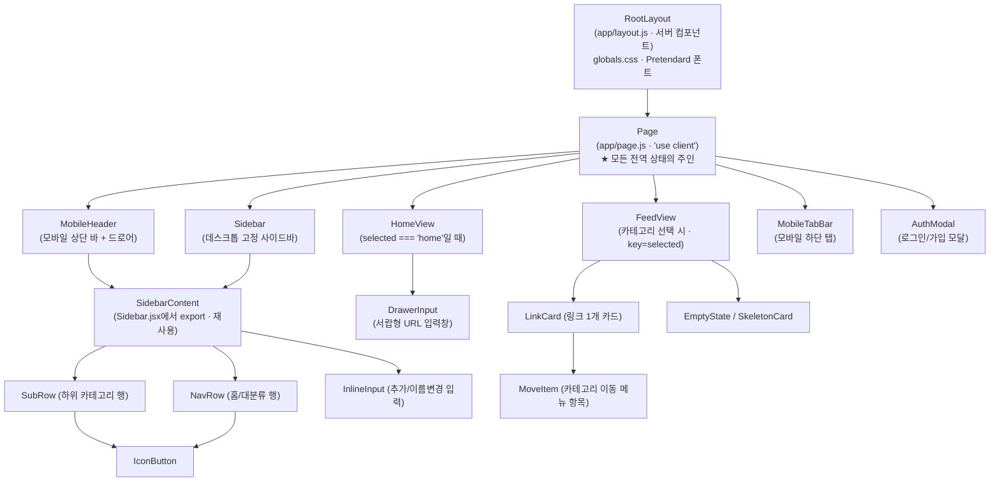
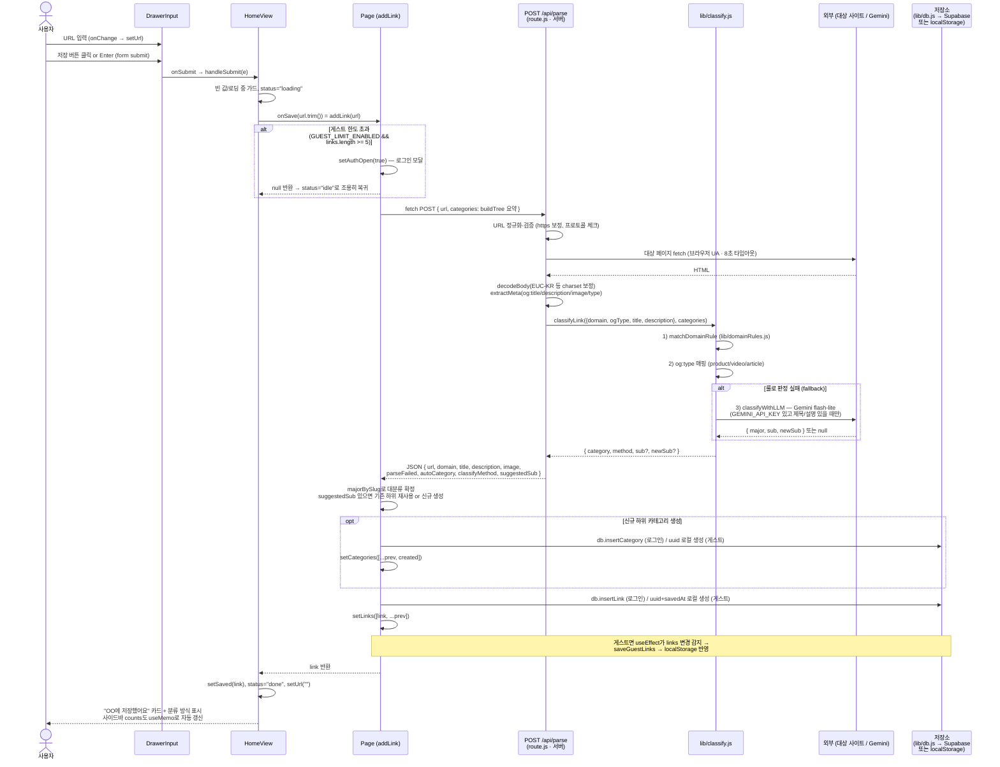
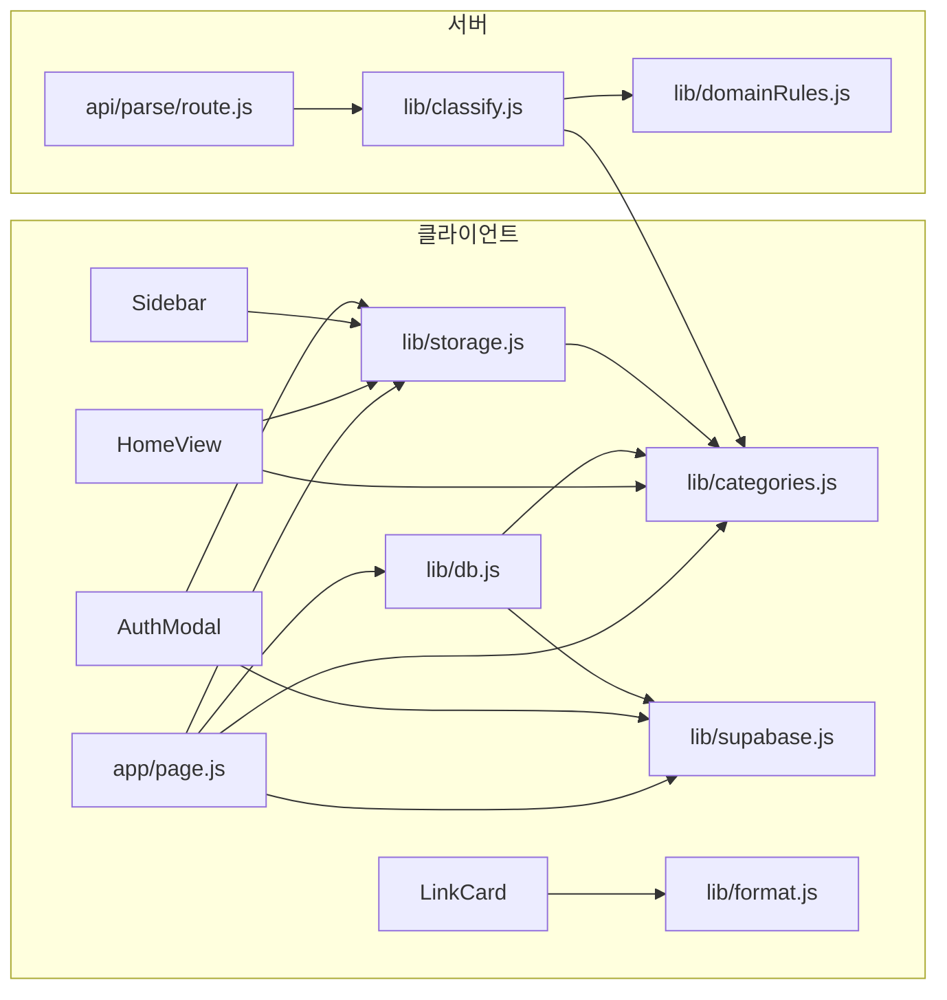

# 나중(Najoong) 아키텍처 — 컴포넌트 구조와 데이터 흐름

> 2026-07 기준 실제 코드를 읽고 작성한 문서.
> 대상: `app/`, `components/`, `lib/` (hub-submit/ 복사본 제외)

---

## 1. 컴포넌트 계층 구조

모든 상태는 최상위 클라이언트 컴포넌트인 `app/page.js`(`Page`)에 모여 있고,
나머지 컴포넌트는 props로 내려받는 **단방향 하향식(top-down)** 구조다.

핵심 포인트:

- **`SidebarContent` 재사용** — 데스크톱 `Sidebar`와 모바일 `MobileHeader`의 드로어가
  같은 `SidebarContent`를 렌더한다. `MobileHeader`는 `onSelect`/`onLogin`을 감싸서
  선택 시 드로어를 닫는 동작만 추가한다.
- **`FeedView`의 `key={selected}`** — 카테고리를 이동하면 컴포넌트가 리마운트되어
  검색어(`query`) 등 내부 상태가 자동 초기화된다.
- **`HomeView` ↔ `FeedView`는 배타적** — `selected === "home"` 여부로 한쪽만 렌더.

---

## 2. props 전달 흐름

### Page → 내비게이션 (`navProps`, MobileHeader·Sidebar 공용)

| prop | 값 (Page 기준) | 용도 |
|---|---|---|
| `tree` | `buildTree(categories)` (useMemo) | 대분류→하위 트리 렌더 |
| `counts` | 카테고리별 링크 수 (useMemo) | 뱃지 숫자 |
| `selected` | `selected` state | 활성 항목 표시 |
| `onSelect` | `setSelected` | 화면 전환 |
| `user` | `user` state | 로그인 영역 분기 |
| `onLogin` | `() => setAuthOpen(true)` | 로그인 모달 열기 |
| `onLogout` | `handleLogout` (supabase signOut) | 로그아웃 |
| `onAddCategory` | `addCategory(majorId, name)` | 하위 카테고리 추가 |
| `onRenameCategory` | `renameCategory(id, name)` | 하위 이름 변경 |
| `onDeleteCategory` | `deleteCategory(id)` | 하위 삭제 |

`SidebarContent`는 이를 그대로 받아 `NavRow`/`SubRow`/`InlineInput`에
개별 콜백(`onClick`, `onRename`, `onDelete`, `onSubmit`)으로 쪼개서 내려보낸다.

### Page → HomeView → DrawerInput

| 단계 | props |
|---|---|
| Page → HomeView | `onSave={addLink}` · `onNavigate={setSelected}` · `categories` · `user` · `guestCount={links.length}` · `onRequestLogin` |
| HomeView → DrawerInput | `value={url}` · `onChange={setUrl}` · `onSubmit={handleSubmit}` · `loading={status === "loading"}` |

`DrawerInput`은 **상태가 없는(controlled) 프레젠테이션 컴포넌트**다.
입력값·저장 로직 모두 HomeView의 것을 쓴다.

### Page → FeedView → LinkCard

| 단계 | props |
|---|---|
| Page → FeedView | `key={selected}` · `category={findCategory(categories, selected)}` · `links={visibleLinks}` · `tree` · `loading` · `onRemove={removeLink}` · `onMove={moveLink}` |
| FeedView → LinkCard | `link` · `tree`(이동 메뉴용) · `onRemove` · `onMove` |

### Page → 기타

- `MobileTabBar`: `tree` · `selected` · `onSelect` (홈 + 대분류 4개 = 탭 5개)
- `AuthModal`: `open={authOpen}` · `onClose` · `atLimit`(게스트 한도 도달 여부)

---

## 3. state 관리 위치

### Page (app/page.js) — 전역 상태의 단일 소유자

| state | 타입 | 설명 |
|---|---|---|
| `user` | object\|null | Supabase 세션 유저. `onAuthStateChange`로 동기화 (id 비교로 중복 리로드 방지) |
| `authReady` | boolean | 세션 조회 완료 여부. supabase 미설정이면 처음부터 `true` |
| `links` | array | 저장된 링크 전체 (게스트: localStorage, 로그인: DB에서 로드) |
| `categories` | array | 평면 카테고리 목록 `{id, name, slug, parentId, ...}` |
| `loading` | boolean | 데이터 로드 중 (FeedView 스켈레톤) |
| `selected` | string | `"home"` 또는 카테고리 id — 어떤 화면을 보여줄지 |
| `authOpen` | boolean | 로그인 모달 표시 |

파생 값(useMemo): `tree`(트리 구조), `counts`(카테고리별 개수, 하위는 대분류에도 합산),
`visibleLinks`(선택 카테고리 + 그 하위 소속 링크).

동기화 effect 3개:
1. 세션 감지 → `user`/`authReady`
2. `user`/`authReady` 변경 → 게스트(localStorage) ↔ DB 데이터 로드 + 로그인 직후 `migrateGuestData` 이관
3. 게스트 상태에서 `links`/`categories` 변경 → localStorage에 즉시 저장

### 하위 컴포넌트 — 화면 지역(local) 상태만

| 컴포넌트 | state | 용도 |
|---|---|---|
| HomeView | `url`, `status`(idle/loading/done/error), `saved`, `error` | 입력값과 저장 진행 상태, 저장 완료 카드 |
| DrawerInput | **없음** | 완전 controlled |
| SidebarContent | `expanded`, `addingTo`, `editingId` | 트리 펼침, 추가/이름변경 모드 |
| SubRow | `menuOpen`, `confirming` | 관리 메뉴, 삭제 2단계 확인 |
| InlineInput | `value` | 입력 중 텍스트 |
| FeedView | `query`, `newestFirst` | 검색어, 정렬 방향 (파생: filtered → sorted) |
| LinkCard | `imageFailed`, `menuOpen` | 썸네일 로드 실패, 이동/삭제 메뉴 |
| MobileHeader | `open` | 드로어 열림 |
| AuthModal | `mode`, `email`, `password`, `busy`, `error`, `notice` | 로그인/가입 폼 |

원칙: **데이터(links/categories/user)는 Page, 표시용 상태는 각 컴포넌트.**
링크·카테고리를 바꾸는 모든 동작은 Page의 콜백(`addLink`, `removeLink`, `moveLink`,
`addCategory`, `renameCategory`, `deleteCategory`)을 거친다.

---

## 4. URL 저장 시 전체 데이터 흐름

단계 요약:

| # | 위치 | 하는 일 |
|---|---|---|
| 1 | `DrawerInput` | 입력값을 HomeView의 `url` state로 올림, submit 이벤트 전달 |
| 2 | `HomeView.handleSubmit` | 가드 후 `onSave` 호출, `status`로 스피너/완료 카드 제어 |
| 3 | `Page.addLink` | 게스트 한도 게이트 → `/api/parse` 호출 → 분류 결과로 카테고리 확정 → 저장 |
| 4 | `route.js` | URL 검증 → HTML fetch → 메타 추출 (파싱 실패도 에러가 아닌 상태로 저장 가능) |
| 5 | `classify.js` | 도메인 룰 → og:type → LLM 폴백 → `etc` 순서의 파이프라인 |
| 6 | 저장 | 로그인: `db.insertLink`(Supabase) / 게스트: 로컬 객체 + localStorage effect |
| 7 | 화면 반영 | `setLinks` → HomeView 완료 카드, 사이드바 counts, FeedView 목록 모두 리렌더 |

---

## 5. lib/ 모듈별 호출 지점

| 모듈 | 실행 위치 | 어디서 쓰나 |
|---|---|---|
| **storage.js** | 클라이언트 | `page.js`(게스트 데이터 load/save/clear), `HomeView`·`Sidebar`·`AuthModal`(`GUEST_LIMIT`, `GUEST_LIMIT_ENABLED` 상수 — 현재 리밋은 `false`로 꺼져 있음) |
| **categories.js** | 양쪽 | `page.js`(`buildTree`, `findCategory`, `majorOf`, `majorBySlug`), `HomeView`(`findCategory`, `majorOf` — 저장 완료 카드 라벨), `storage.js`·`db.js`(기본 카테고리 시드 `DEFAULT_MAJORS`/`DEFAULT_SUBS`), `classify.js`(`MAJOR_SLUGS` 검증) |
| **db.js** | 클라이언트 (로그인 시에만) | `page.js` 전용 — fetch/insert/delete/update Link·Category, `createDefaultCategories`, `migrateGuestData` |
| **supabase.js** | 클라이언트 | `page.js`(세션), `AuthModal`(로그인/가입/OAuth), `db.js`(모든 쿼리). env 미설정이면 `null` — 앱은 게스트 모드로 동작 |
| **classify.js** | **서버 전용** | `app/api/parse/route.js`에서만 호출. `classify`(룰) → `classifyWithLLM`(Gemini) 파이프라인 |
| **domainRules.js** | 서버 (classify 경유) | `classify.js`의 `matchDomainRule` — 도메인→대분류 시드 테이블, 서브도메인·최장 일치 |
| **format.js** | 클라이언트 | `LinkCard`(`timeAgo` — "3분 전" 표기) |

의존 방향 (순환 없음):

경계가 명확하다: **분류 로직(classify/domainRules)은 서버에만, 저장소 접근(storage/db)은
클라이언트에만** 있다. `categories.js`만 양쪽에서 공유되는 순수 유틸이다.

---

## 부록: 게스트 → 로그인 전환 흐름

1. 로그인 성공 → `onAuthStateChange` → `user` 변경
2. 데이터 로드 effect 재실행: `fetchCategories` (없으면 `createDefaultCategories`)
3. `migrateGuestData(userId, cats, loadGuestLinks(), loadGuestCategories())`
   — 게스트 카테고리를 slug/이름으로 DB 카테고리에 매핑(없는 하위는 생성), 링크에 `user_id`를 붙여 insert
4. 이관 성공 시 `clearGuestData()` → localStorage 정리 후 DB 기준으로 재로드
